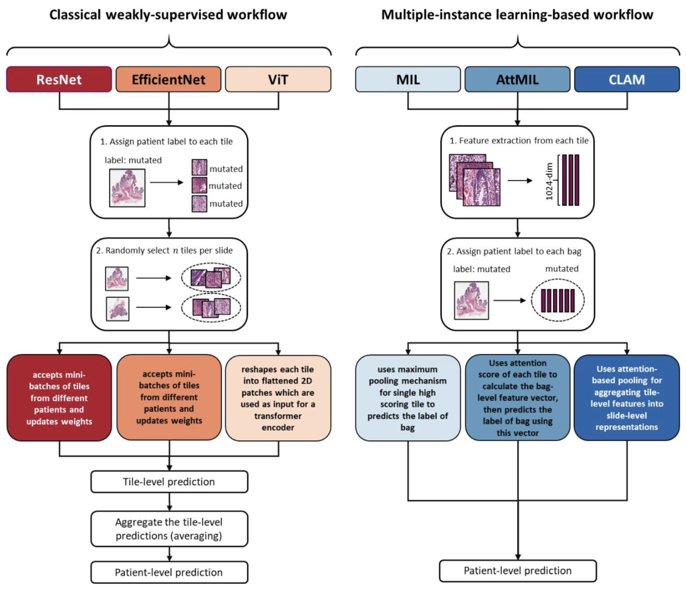

# 2022/07/22

## Logistics

1. [Zotero group](https://www.zotero.org/groups/4731778/orion-ml)

1. File list for the flowing shared on orion_ai_team slack channel

    TODO: Add single cell table
    - ORION IF
    - Post-H&E (GT450)
    - segmentation mask (nucleiRingMask.tif)

1. Edward's Alienware PC available @ LSP (🙏 Clarence!)

1. File transfer to FAS file server

    NOTE FROM @Siyu

---

## Discussions

### Review articles

#### 1) 2022 - A comprehensive review of computer‑aided whole‑slide image analysis: from datasets to feature extraction, segmentation, classifcation and detection approaches https://doi.org/10.1007/s10462-021-10121-0

> In **classical weakly-supervised analysis pipelines**, all tiles inherit the slide label while in **multiple-instance learning (MIL)**, only bags of tiles inherit the label. However, it is still unclear how these widely used but markedly different approaches perform relative to each other

- Classical weakly-supervise learning

    > Models are trained on N randomly selected tiles per WSI and tile-level predictions are averaged for each patient. Empirically, this can yield clinical-grade performance despite weak labels (Coudray and Tsirigos, 2020, Echle et al., 2020), even without any annotation (Kather et al., 2020, Muti et al., 2021). Three different AI models were used within this classical approach: ResNet, EfficientNet, and Vision Transformers (ViT).

- MIL (multiple-instance learning) w/ or w/o attention-based aggregation functions

    > The conceptual limitations of the classical weakly-supervised computational pathology workflow are addressed by multiple instance learning (MIL). MIL groups all tiles from a given patient in “bags”. The label of individual tiles is unknown, but the label of the bag is positive if there is at least one positive instance within that bag. In theory, MIL is well suited to handle a heterogeneous set of tiles obtained from different regions in a WSI. In this study, we tested three different MIL methods: Classical MIL, Attention-based MIL (AttMIL), and Clustering constrained Attention MIL (CLAM).

> Artificial intelligence (AI)-based image analysis is widely used for end-to-end classification of histopathological whole slide images (WSI). Common applications of such end-to-end workflows are tumor detection (Campanella et al., 2019, Pinckaers et al., 2021), subtyping (Lu et al., 2021, Wang et al., 2020, Zhu et al., 2021), and grading (Bulten et al., 2020, Shaban et al., 2020, Ström et al., 2020).

**Figure 1, data and design**

**Figure 2**

**Peformance**

**Qualitative assessment of network performance**

2022 - Benchmarking weakly-supervised deep learning pipelines for whole slide classification in computational pathology https://doi.org/10.1016/j.media.2022.102474

2022 - One Model is All You Need: Multi-Task Learning Enables Simultaneous Histology Image Segmentation and Classification https://arxiv.org/pdf/2203.00077v1.pdf

### Tools

- https://github.com/TissueImageAnalytics/tiatoolbox
- https://github.com/jamesdolezal/slideflow
- https://github.com/markowetzlab/pathml